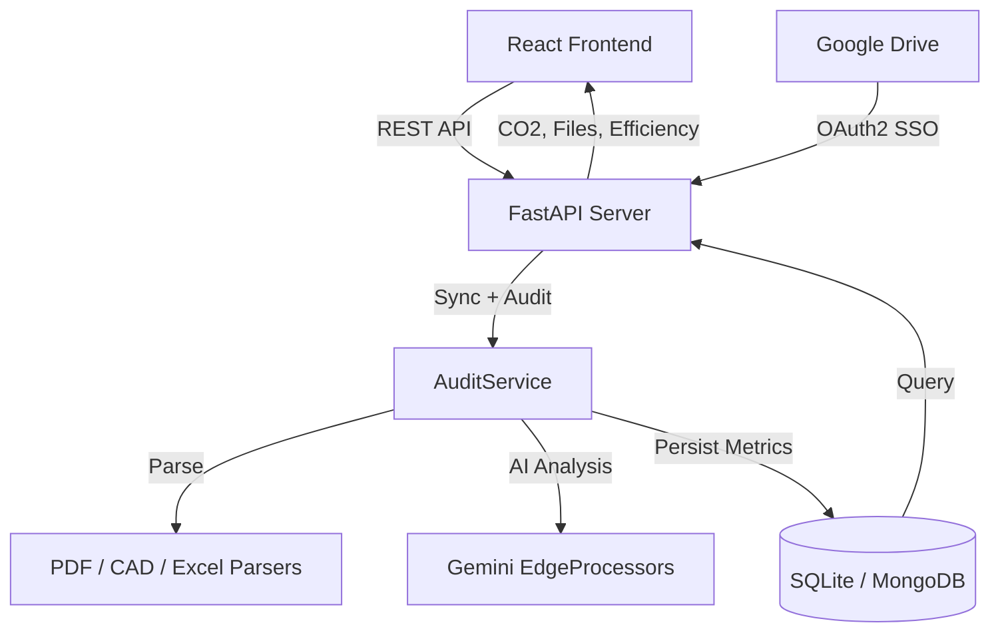
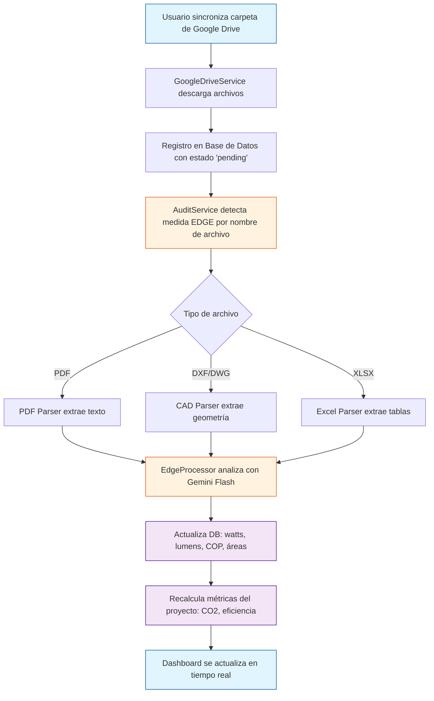

# GProA EDGE — Plataforma de Certificación Inteligente

[](https://github.com/gproatechnology/GProA_Edge/actions)
[]()
[]()
[]()

> **Outcome**: Reducción del tiempo de documentación para certificación EDGE en hasta **80%**, con mayor confiabilidad de auditoría y velocidad de cumplimiento.

**GProA EDGE** es una plataforma profesional que transforma datos de construcción no estructurados en entradas de certificación estructuradas y auditables. Combina inteligencia artificial, integración con Google Drive y un dashboard ejecutivo en tiempo real para equipos de consultoría de edificios verdes.

---

## ✨ Funcionalidades Principales

- 📋 **Gestión de Proyectos**: Administración centralizada de proyectos y tipologías de certificación.
- 🧠 **Procesamiento con IA**: Clasificación y extracción técnica ultrarrápida con Gemini Flash (Watts, Lúmenes, áreas).
- 🔗 **Sincronización con Google Drive**: Descarga automática de archivos desde carpetas del Drive del usuario.
- 🤖 **Motor de Auditoría Automática**: Al sincronizar, cada archivo es clasificado, parseado y analizado sin intervención manual.
- 📊 **Dashboard en Tiempo Real**: KPIs de CO2, archivos procesados y eficiencia energética actualizados automáticamente.
- 🔐 **SSO con Google**: Autenticación con cuenta de Google, detección automática de rol (CEO / Consultor).
- 🎨 **Identidad de Marca Premium**: Logo Cloud animado en login, branding EOSIS y EDGE integrado.
- 📤 **Exportación Enterprise**: Generación de Excel estructurado listo para entrega a certificadores.
- 💬 **Asistente IA Contextual**: Consultor experto integrado con reglas estrictas y directas, alimentado por el estado real de cada proyecto en base de datos.

---

## 🛠 Stack Tecnológico


---

## 🏗️ Arquitectura del Sistema



---

## 🔄 Flujo de Datos: Drive → Dashboard



---

## 🔐 Autenticación SSO

- **OAuth2 con Google**: Flujo completo con scopes `drive.readonly`, `userinfo.profile`, `userinfo.email`, `openid`.
- **Detección de Rol Automática**: Si el email contiene `gproatechnology` → rol **CEO** con permisos de administrador. Otros emails → rol **Consultant**.
- **Limpieza de Sesión**: `localStorage.clear()` en logout garantiza que no persistan datos de sesión anteriores.
- **Fallback de Avatar**: Si Google no entrega foto de perfil, se muestra una inicial dinámica basada en el nombre real del usuario.

---

## 📊 Métricas del Dashboard (Tiempo Real)

| Métrica | Fuente |
|---|---|
| **Total Proyectos** | Conteo real de la base de datos |
| **Archivos Totales** | `files_count_documents()` por proyecto |
| **Archivos Procesados** | Archivos con `status = 'processed'` |
| **Reducción CO2** | Calculado por `AuditService.recalculate_project_metrics()` |
| **Eficiencia Energética** | Promedio de ahorros EEM detectados |

---

## 🤖 Motor de Auditoría (AuditService)

Nuevo servicio en `backend/app/services/audit_service.py` que orquesta:

1. **Detección de Medida**: Identifica EEM22, EEM09, WEM01, WEM02, EEM16 por nombre de archivo.
2. **Parseo Multihilo**: Ejecuta `PDFParser` y `CADParser` mediante `asyncio.to_thread` en segundo plano para evitar congelar la interfaz de usuario.
3. **Procesamiento Especializado**: Llama al `EdgeProcessor` correcto (luminarias, HVAC, agua, diseño/planos).
4. **Persistencia**: Actualiza el registro del archivo con `watts`, `lumens`, `specialized_data`.
5. **Recalculo de Proyecto**: Agrega métricas de CO2 y eficiencia al proyecto padre.

---

## 🎨 Identidad Visual (v2.0)

- **Login Screen**: Fondo animado con "Logo Cloud" — múltiples logos de EOSIS y EDGE flotando con efectos de paralaje y opacidades dinámicas.
- **Sidebar**: Avatar dinámico con foto de perfil de Google o inicial corporativa como respaldo.
- **Branding**: Paleta de colores unificada entre GProA, EOSIS y EDGE.

---

## 🚀 Despliegue Local

### Prerequisitos
- Python 3.12+
- Node 18+
- Cuenta de Google con acceso a `credentials.json` de OAuth2

### Inicio Rápido (Windows)
```powershell
# Desde la carpeta docs/
.\GProA_EDGE_Launcher.ps1

# Opciones del Launcher:
# [2] Iniciar Backend + Frontend
# [6] Reiniciar Backend (después de cambios en Python)
```

### Estructura de Archivos
```
GProA_EOSIS_Edge/
├── backend/
│   ├── app/
│   │   ├── api/endpoints/      # projects, files, google_drive, analysis
│   │   ├── services/
│   │   │   ├── audit_service.py        # NUEVO: Motor de auditoría automática
│   │   │   ├── google_drive_service.py # Sync + disparo de auditoría
│   │   │   ├── edge_processors.py      # EEM22, EEM09, WEM, EEM16
│   │   │   └── parsers/                # PDF, CAD, Excel, Image
│   │   ├── db/database.py      # SQLite + MongoDB unificado
│   │   └── schemas/schemas.py  # Modelos con co2_reduction, energy_savings
│   └── data/
│       ├── credentials.json    # OAuth2 de Google (no incluido en repo)
│       └── gproa.db            # Base de datos SQLite local
├── frontend/
│   └── src/
│       ├── components/
│       │   ├── Login.js        # SSO Google + Logo Cloud animado
│       │   ├── Sidebar.js      # Avatar dinámico de Google
│       │   └── ChatAssistant.js # Saludo personalizado por rol
│       └── App.js
├── docs/
│   ├── GProA_EDGE_Launcher.ps1 # Launcher interactivo de Windows
│   └── LOCAL_DEPLOYMENT.md
└── README.md
```

---

## 🗺️ Roadmap

### ✅ v2.0 — Completado (Mayo 2026)
- [x] SSO con Google OAuth2 (Drive + Profile)
- [x] Sincronización automática de archivos desde Google Drive
- [x] Motor de Auditoría Automática (`AuditService`)
- [x] Dashboard con métricas reales (CO2, archivos, eficiencia)
- [x] Identidad de marca premium (Logo Cloud, avatar dinámico)
- [x] Detección de rol CEO / Consultor por email
- [x] Chat Asistente con contexto real del proyecto

### 🔜 v2.1 — Próximos Pasos
- [ ] Validación de imagen de perfil de Google en Sidebar
- [x] Procesamiento en background (asyncio tasks & to_thread) para parseo de archivos pesados
- [ ] Panel de auditoría detallado por medida EDGE
- [ ] Exportación a formato EDGE App (.xlsx certificador)
- [ ] RBAC completo (Admin, Auditor, Consultor, Cliente)

### 🏢 v3.0 — Enterprise
- [ ] Multi-tenant con aislamiento de datos por organización
- [ ] Integración Computer Vision para CAD determinístico
- [ ] API pública para integraciones ERP / BIM
- [ ] SharePoint Sync

---

## 🧪 Modos de Operación

| Feature | **Demo** (Default) | **Producción** |
|---|---|---|
| **Base de datos** | SQLite local | MongoDB Atlas |
| **Motor IA** | Mock data | Google Gemini Flash |
| **Google Drive** | Sin sync | Sync completo OAuth2 |
| **Costo** | $0 | Por token Gemini |

---

## 📄 Variables de Entorno

| Variable | Descripción | Requerido |
|---|---|---|
| `GEMINI_API_KEY` | Clave API de Google AI (Gemini Flash) | Para IA real |
| `MONGO_URL` | Connection string MongoDB Atlas | Para prod |
| `GOOGLE_OAUTH_CLIENT_ID` | Client ID de Google Cloud Console | Para SSO |
| `CORS_ORIGINS` | Orígenes permitidos | En producción |

---

## 🤝 Contribución
1. Fork & clone
2. Branch desde `submain`
3. PR a `submain` → revisión → merge a `main`

## 📄 Licencia
MIT — GProA Technology © 2026

## 🙏 Créditos
- [EDGE Buildings](https://edgebuildings.com/) — Estándar de certificación
- [IFC EDGE](https://ifc.org/our-work/edge/) — Software oficial de certificación
- [Google Cloud](https://cloud.google.com/) — OAuth2 & Drive API
- [Google DeepMind](https://deepmind.google/) — Gemini 1.5 Pro

---
⭐ ¡Dale una estrella en GitHub si este proyecto te es útil!
